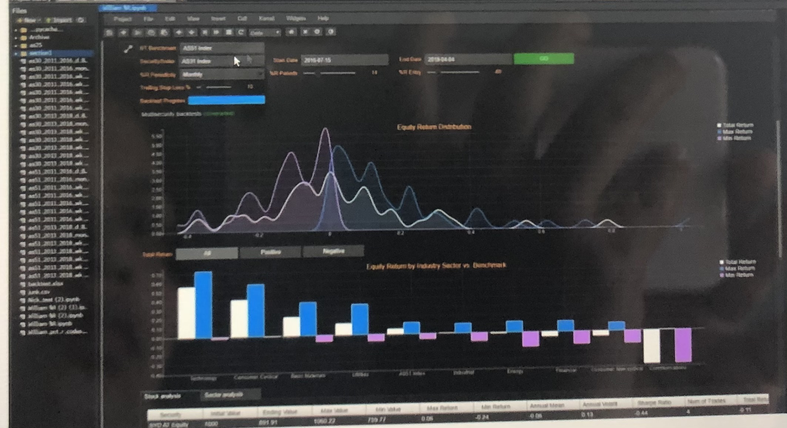
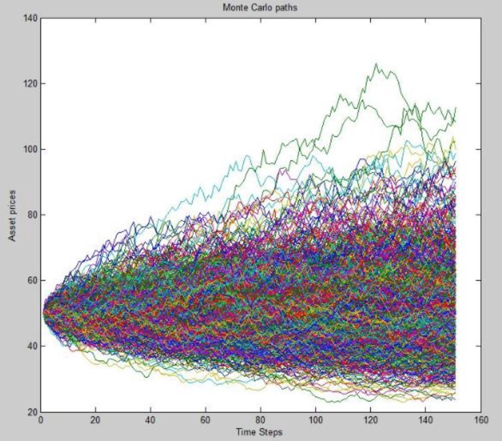

# Fintech_Project_1
Fintech Project 1

## Project Airline vs Tech 
---
Contributors: Alpa Sheladia, Jayshrey Dudhia, Will Turner, Brandon Srinath
---
In this project, our team collectively decided to compare two specific industries that have been negatively and postively affected by the Covid-19 pandemic. Due to the travel restrictions placed on people around the glode because of the pandemic, the airline industry has struggled to persevere in the market. On the other hand, the tech industry after taking a hit from the March lows has recovered completely and has even reached new record highs when compared with stock prices. We will  be cleaning financial data of both the industries including the operating balance sheets of different companies and then also compare the two industries with stock prices and market caps. 
--- 
## Requirements:
1) Use Pandas to clean and format your datasets.
2)create Jupyter note book discribing the data exploration and cleanup process
3)create a jupyter notebook illustrating the final analysis
4)use PyViz, Panel, Plotly Express, and HvPlots to create a total of 6-8 visualizations of your data ( ideally 2 per question you asked. Thereafter, aggregate these visualizations into dashboard.
5)save PNG images of visulizations to distribute to the class and instructional team, and for inclusion in your presentation and your repo's README.md file.
### Optional:
* Use atlest one API, if you can find an API with Data pertinent to your rimery research questions.
*Use one new Python library that hasn't been covered in class. 
* Create README.md in your repo with write-up summarizing your major findings. This should include a heading for each "Question" you ask if your data, and under each heading, a short discription of what you found and any relevent plots.

## Presentation Requirements :
# questions you found the data you used to answer these questions.
# Where and how you found the data you used to answer these questions
# The data exploration and cleanup process ( accomapnied by your Jupyter Notebook)
# The analysis process ( accompanied by your Jupyter Notebook)
# Your conclusions, which should include numarical summery and visualizations of that summery
# The implications of your findings: what do your findings mean? how do they impact Finance?  

## This project will use these practices to achieve final goals:
•	Use of aggregation functions like Groupby, HAVING clause, SELECT statements, Avg, Min, Max, Count, Sum, ect
•	Attempt various types of assessments like algorithms, arrays, linked lists, strings, HashMap ect using tools such as Code signal Arcade, Hackerrank, and Leetcode. 
•	Use large database with more info than needed 
•	Portfolio analyzers: 
•	prepare a tearsheet for a portfolio that includes calculations, tables, charts, financial models, Monte Carlo simulations and statistical analysis of portfolio performance.

•	Create and host a dashboard for the tearsheet with interactive visualizations and a storyboard interface 

•	Answer these questions: 
 1)	What do your result suggest about the current portfolio performance?
 2)	What would you recommend customizing to improve the portfolio? 
 
 

## Research Questions to ask
---
1. Where were the industries before Covid-19 pandemic?
2. How did covid-19 affect these industries?
3. What impact did it have on the overall market?
4. What can each industry do next to sustain their business?

---
1. Data Cleaning/Formatting

2. Merging/comparison/plotting

3. Understanding the data/Visualizations including MonteCarlo

4. Suggestions
---
## References
- https://www.transtats.bts.gov/Fields.asp - operating balance sheet of airline industry
- https://www.iata.org/contentassets/36695cd211574052b3820044111b56de/airline-industry-economic-performance-dec19-report.pdf - sample analysis report of Airline industry from 2018-2020
- https://www.kaggle.com/shaivyac/us-airline-dataset?select=Airline_dataset.csv - US airline Dataset
- https://www.kaggle.com/borismarjanovic/price-volume-data-for-all-us-stocks-etfs- stockmarket data
- https://www.nasdaq.com/market-activity/index/xal/historical - https://www.nasdaq.com/ airline stock prices dataset

