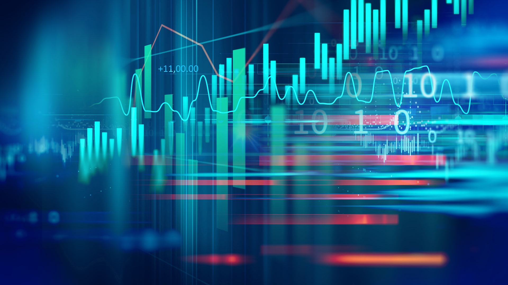

# Fintech_Project_1

# *** Airline vs Tech***
			
--- 

---
***Contributors: Alpa Sheladia, Jayshrey Dudhia, Will Turner, Brandon Srinath***

In this project, our team collectively decided to compare two specific industries that have been negatively and postively affected by the Covid-19 pandemic. Due to the travel restrictions placed on people around the glode because of the pandemic, the airline industry has struggled to persevere in the market. On the other hand, the tech industry after taking a hit from the March lows has recovered completely and has even reached new record highs when compared with stock prices. We will  be cleaning financial data of both the industries including the operating balance sheets of different companies and then also compare the two industries with stock prices and market caps. 

Initially setting up the scope and the depth of the project was handled by the team. We spent a few class days discussing the purpose and more importantly our reason for doing our project and finding data. We extended the Portfolio Analysis homework assignment with complexity by having two completely different industries as we felt it was vital for this project. We decided to conduct a financial analysis on 5 industry-focused portfolios of airlines and top 5 tech companies to properly provide user with an accurate analysis of how Covid-19 affected its future including the stock market data. 

## **Loading Data** 
--

With the use of www.alphavantage.co we were able to load json and corresponding close prices for 3 portfolios (Airline, Technology, and stock market) and two distinctive time periods (Pre-Covid & Post-Covid). We normalized all tables/data within our Jupyter notebook to ensure optimal flexibility and workability. 
We imported quarterly data of 2019-2020 top 5 airline companies such as American Airline "AAL", United Airlines "UAL",Southwest Airline "LUV", Delta Airline "DAL", Alaska Airline "AL"  

 
Likewise for Tech companies we are gathering quterly data of Apple "AAPL",Alphabet "GOOGL", Amazon "AMZN", Microsoft "MSFT", and Facebook "FB" from www.alphavantage.co.  
Gerated key from Alphadvantage which we incorporated it into jupyter notebook using python libraries "from dotenv import load_dotenv and key = os.getenv("alphavantage_api_key") which furnished us with JSON dataset. 

We used For loop and GetRequest to convert that data to CSV files.  
We also needed to import stock price of each industries and S&P 500 dataset. 

---

##  **Data Cleaning/Formatting**

Once we had our data csv files together, Data needed to clean and sort data. There was a lot of effort and iteration that went into our final analysis and presentation. Will, Shrey, Brandon and I spent countless hours perfecting the code to make it standardized allowing plug and play functionality. Below you will find several parts of the iteration process. Connecting data files by common columns and plotting.  

We used for loop to request data for each company and converted into csv files using to_csv. 

## **Implementation New Library**  

We also used new library called "Time" we were limited to make 5 request a minute, therefore, 
we included “time.sleep(60) “ to make codes wait 60 seconds upon encountering potential error. 

----
 
## **Merging/comparison/plotting**

We used Arrays, NumPy and concates to form data frame. Mean function was used to show changes in percentiles of both industries. Additionally, we used truncate as shorthand for boolean indexing based on index values before certain theshholds. 

''airline_total_assets_dataframe = airline_total_assets_dataframe.truncate(before=airline_total_assets_dataframe.index.values[14])
airline_total_assets_dataframe.set_index('date', inplace=True)''
---

----

## **Understanding the data/Visualizations**

With little help from array we cleaned our data and used hvplot for visual so it can be pleasing to viewer’s eyes. We have used combinations of scattermaps, hvplots, and barsets to display various intentions. 

To complete this project, we used the concepts discussed in class; Python, Pandas, various libraries, and Simulation Visuals. 

### Analysis

## ***Where were the industries before Covid-19 pandemic?***

According to airline association of North America, airlines were experiencing “Golden Age”. The conducted study showed that combination of newer planes, enhanced consumer touchpoints and appealing ticket value had propelled airlines to it’s highest point in history. America alone was entertaining 2.5 million travelers per day. As recent as in Jan. and Feb. 2020, American airline was increased approximately anywhere in between 5.5% to 6.5%.  

 
### ***How did covid-19 affect these industries? ***

Airlines saw their fall in late April 2020 when passenger volumes were down as low as 96% to historically low. U.S. airlines have grounded more than 3000 aircraft costing them collectively over $10 billion of cash per month. 
American tech industry was already doing well before pandemic while making billions of dollars a year. Now that we’re on the serge for Covid cases, tech titans are at their new heights. Presently, Tech industry is dominating American businesses in a way we saw railroad era in late 1800s.  

 On the contrary, technology stocks elevated the S&P 500 stock index to a record high in August. The stocks of Apple, Facebook, Alphabet, Amazon and Microsoft rose proximately 37% in the first seven months in 2020. These organizations contributes 20% of the stock market’s total worth including Apple’s highest value that managed to reach $2 trillion.  
 
### ***What impact did it have on the overall market?***

The overall market became volatile as pandemic progressed. Currently, airline industry is at its worst volatility, followed by Tech industry. Although, it would be safer to say that tech company is carrying the S&P 500’s majority of index. 

 
### ***What can each industry do next to sustain their business?***

 Our advice to airline industry is that they need cushion of more cash on hand to survive this pandemic by taking advantage of the relief opportunity provided in the CARES Act, accessing outside sources of cash like unsecured and secured loans, and cost cutting.
For instance, rescinding issuance of dividends or stock repurchases, deferring aircraft deliveries to the extent negotiations with manufacturer, halting capital projects, negotiating vendors and airport partners to secure flexibility or relief on payment terms and timing, and securing voluntary unpaid leaves or salary reductions. Perhaps it would be rewarding to turn focus on 
sheltering domestic business by making consumer feel safe and building alliance with tech companies to provide better business-related services.  
Although, tech industry is doing much better than airline industry, they can face problems if they don’t take preventative actions. For example, it becomes vital to account for uncertainty and fragile economy of an evolving pandemic. Diminishing business travels results in fewer client interactions, it can impact workforce with slower recruiting process can compromise pipeline of skilled workforce. Cyber security risks are higher with more employees working remotely.  
	Tech industry can avoid many of these issues by taking preventative steps and building cybersafe platforms to support remote employees. They can create framework for data analysis and decision-making. 
	Airline was most volatile in the beginning of the pandemic and followed by tech. Nevertheless, both industries are at different wavelength.  
 
our analysis shows that there is significant changes in the market due to Covid-19. We have a long road ahead of us on the recovery. As for S&P 500 index, tech stock is the way to go for now and in future.  

#### References

https://www.alphavantage.co/Stock APIs in JSON, Excel & Google Sheets
 FX and cryptocurrency data feeds
 50+ technical indicators
 Global coverage
- https://www.transtats.bts.gov/Fields.asp - operating balance sheet of airline industry
- https://www.iata.org/contentassets/36695cd211574052b3820044111b56de/airline-industry-economic-performance-dec19-report.pdf - sample analysis report of Airline industry from 2018-2020
- https://www.kaggle.com/shaivyac/us-airline-dataset?select=Airline_dataset.csv - US airline Dataset
- https://www.kaggle.com/borismarjanovic/price-volume-data-for-all-us-stocks-etfs- stockmarket data
- https://www.nasdaq.com/market-activity/index/xal/historical - https://www.nasdaq.com/ airline stock prices dataset

